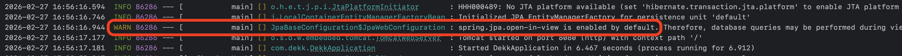

> **작성자:** 이지윤

## 들어가며

스프링 부트 실행 시 아래와 같은 warning 표시를 보신 적 있으신가요?



> 이런 `warning` 로그도 무시하지 않는 개발자가 되어 봅시다!

그래서 오늘은 **OSIV(Open Session In View)** 에 대해서 알아보려 합니다.

---

## OSIV(Open Session In View)란?

요청(Request) 시작부터 응답(Response) **끝까지 영속성 컨텍스트(Persistence Context)를 열어두는 전략**을 말합니다.

Spring Boot에서는 기본값이 `true`입니다.

```yml
spring.jpa.open-in-view=true  # 기본값
```

이름이 낯설 수 있는데, 풀어서 보면 이렇습니다.

| 단어 | 의미 |
|------|------|
| Open | 열어두다 |
| Session | JPA의 영속성 컨텍스트 (Hibernate에선 Session이라 부름) |
| In View | View(응답)를 만드는 시점까지 |

즉, **"응답을 만드는 시점까지 Session(영속성 컨텍스트)을 열어두겠다"** 는 뜻입니다.

---

## 왜 OSIV가 나오게 되었는가

OSIV를 이해하려면 먼저 두 가지 개념을 알아야 합니다.

### 1. 영속성 컨텍스트(Persistence Context)의 기본 동작

JPA는 기본적으로 **트랜잭션 안에서만** 영속성 컨텍스트가 활성화됩니다.

```
트랜잭션 시작 → 영속성 컨텍스트 생성
트랜잭션 종료 → 영속성 컨텍스트 소멸
```

트랜잭션이 끝난 이후에는 영속성 컨텍스트가 닫히기 때문에, 이 시점 이후로는 **지연 로딩(LAZY Loading)이 불가능**합니다.

### 2. LAZY 로딩을 왜 써야 하나요?

JPA를 사용할 때 연관관계 설정 시 `EAGER` vs `LAZY` 두 가지 방식이 있습니다.

```java
// EAGER: 조회 시 연관된 데이터를 즉시 모두 가져옴
@ManyToOne(fetch = FetchType.EAGER)
private Team team;

// LAZY: 연관된 데이터를 실제로 사용할 때 가져옴
@ManyToOne(fetch = FetchType.LAZY)
private Team team;
```

**EAGER의 문제점**

- 필요하지 않은 데이터까지 모두 로딩 → 성능 저하
- 예측하지 못한 N+1 문제 발생
- 쿼리 제어가 어려워짐
- 양방향 관계에서 순환 참조 위험

그래서 JPA 설계 원칙은 다음과 같습니다.

> **모든 연관관계는 LAZY로 설정하고, 필요한 경우 fetch join으로 명시적으로 가져와라**

### 3. 문제 상황: LAZY + 트랜잭션 밖에서 접근

그런데 여기서 문제가 생깁니다.

일반적인 MVC 구조에서 트랜잭션은 **Service 계층**에서 시작하고 끝납니다.

```
Controller → Service(트랜잭션 시작/종료) → Repository
```

트랜잭션이 끝난 뒤 Controller에서 LAZY 로딩된 객체에 접근하면?

```java
// Service (트랜잭션 종료)
public Member findMember(Long id) {
    return memberRepository.findById(id).orElseThrow();
}

// Controller (트랜잭션 없음)
Member member = memberService.findMember(1L);
String teamName = member.getTeam().getName(); // 💥 LazyInitializationException!
```

영속성 컨텍스트가 이미 닫혀있기 때문에 `LazyInitializationException`이 발생합니다.

> 이 문제를 해결하기 위해 등장한 패턴이 바로 **OSIV**입니다!

---

## OSIV = true (기본값)

### 동작 방식

```
HTTP 요청
    │
    ▼
[Filter / Interceptor]
    │  ← 영속성 컨텍스트 생성 & DB 커넥션 획득
    ▼
[Controller]
    │
    ▼
[Service] ← 트랜잭션 시작
    │           (영속성 컨텍스트 재사용)
    │      ← 트랜잭션 종료
    │           (영속성 컨텍스트는 유지됨)
    ▼
[Controller] ← 여기서도 LAZY 로딩 가능!
    │
    ▼
HTTP 응답
    │  ← 영속성 컨텍스트 소멸 & DB 커넥션 반납
```

Spring Boot에서는 `OpenEntityManagerInViewInterceptor`가 이 역할을 담당합니다.
요청이 들어오는 순간 영속성 컨텍스트를 열고, 응답이 나가는 순간에 닫습니다.

### 장점

- Controller, View 어디서든 LAZY 로딩 가능
- `LazyInitializationException` 걱정 없음
- 개발이 편리함

### 단점

**DB 커넥션을 오랫동안 점유합니다.**

```
요청 시작 ──────────────────────────────────── 응답 종료
    │                                           │
    ├── DB 커넥션 획득                             │
    │                                           │
    │[Service 로직]  [Controller 로직] [응답 직렬화] │
    │                                           │
    └───────────────── DB 커넥션 반납 ─────────────┘
```

응답 직렬화가 오래 걸리거나 외부 API 호출처럼 시간이 걸리는 작업이 있을수록
그 시간 동안 **DB 커넥션이 묶여 있습니다.**

커넥션 풀(HikariCP 기본 10개)이 가득 차면 다른 요청이 대기하게 되고,
트래픽이 몰릴 때 **장애로 이어질 수 있습니다.**

---

## OSIV = false

### 설정 방법

```yml
spring:
  jpa:
    open-in-view: false
```

### 동작 방식

```
HTTP 요청
    │
    ▼
[Filter / Interceptor]
    │  ← 영속성 컨텍스트 생성 안 함
    ▼
[Controller]
    │
    ▼
[Service] ← 트랜잭션 시작 & DB 커넥션 획득 & 영속성 컨텍스트 생성
    │
    │      ← 트랜잭션 종료 & DB 커넥션 반납 & 영속성 컨텍스트 소멸
    ▼
[Controller] ← LAZY 로딩 불가!
    │
    ▼
HTTP 응답
```

### 장점

- DB 커넥션을 Service 계층에서만 사용 → 커넥션 점유 시간 최소화
- 트래픽이 많은 서비스에서 성능 유리

### 단점

- Controller에서 LAZY 로딩 시도하면 `LazyInitializationException` 발생
- Service 계층에서 필요한 데이터를 미리 모두 로딩해야 함
- 코드 복잡도가 올라갈 수 있음

---

## 그래서 어떻게 해야 할까요?

OSIV를 `false`로 설정했다면, **트랜잭션 안에서 필요한 데이터를 모두 로딩**해야 합니다.

대표적인 해결 방법 세 가지를 소개합니다.

### 방법 1: fetch join으로 한 번에 조회

JPQL에서 fetch join을 사용하면 연관된 엔티티를 한 쿼리로 가져올 수 있습니다.

```java
// Repository
@Query("SELECT m FROM Member m JOIN FETCH m.team WHERE m.id = :id")
Optional<Member> findByIdWithTeam(@Param("id") Long id);

// Service
@Transactional(readOnly = true)
public MemberResponse getMember(Long id) {
    Member member = memberRepository.findByIdWithTeam(id)
            .orElseThrow(() -> new EntityNotFoundException("Member not found"));

    // 트랜잭션 안에서 team 데이터도 이미 로딩됨
    return MemberResponse.from(member);
}
```

### 방법 2: @EntityGraph 활용

`@EntityGraph`를 사용하면 fetch join을 어노테이션으로 간결하게 표현할 수 있습니다.

```java
// Repository
@EntityGraph(attributePaths = {"team"})
Optional<Member> findById(Long id);
```

### 방법 3: DTO로 직접 조회

엔티티 대신 DTO로 바로 조회하면 LAZY 로딩 문제 자체가 없어집니다.
필요한 데이터만 정확히 가져오기 때문입니다.

```java
// DTO
public record MemberResponse(Long id, String name, String teamName) {
    public static MemberResponse from(Member member) {
        return new MemberResponse(
            member.getId(),
            member.getName(),
            member.getTeam().getName()
        );
    }
}

// Service - 트랜잭션 안에서 DTO로 변환
@Transactional(readOnly = true)
public MemberResponse getMember(Long id) {
    Member member = memberRepository.findById(id)
            .orElseThrow(() -> new EntityNotFoundException("Member not found"));

    // 트랜잭션 종료 전에 DTO로 변환 → LAZY 로딩 문제 없음
    return MemberResponse.from(member);
}
```

---

## 정리: OSIV true vs false

| 구분 | OSIV = true (기본값) | OSIV = false |
|------|----------------------|--------------|
| 영속성 컨텍스트 범위 | 요청 시작 ~ 응답 종료 | 트랜잭션 범위 |
| DB 커넥션 점유 시간 | 길다 (요청 전체) | 짧다 (트랜잭션만) |
| Controller LAZY 로딩 | 가능 ✅ | 불가 ❌ |
| 개발 편의성 | 높음 | 낮음 (별도 처리 필요) |
| 트래픽 많을 때 성능 | 불리 | 유리 |
| 권장 상황 | 간단한 관리자 페이지 등 | 실시간 트래픽 많은 서비스 |

---

## 결론

처음에 봤던 warning 로그는 Spring Boot가 이렇게 말하는 것입니다.

> "OSIV가 켜져 있어서 DB 커넥션이 오래 점유될 수 있어. 트래픽 많으면 조심해!"

우리 프로젝트는 실사용자를 대상으로 하는 서비스인 만큼, **OSIV를 `false`로 설정하는 것이 좋을 것 같습니다.**
fetch join이나 DTO 조회를 통해 필요한 데이터를 명시적으로 가져오는 방식으로 개발하면, 커넥션 풀 고갈 걱정 없이 안정적인 서비스를 만들 수 있습니다.

우리 모두 warning 로그 하나도 무시하지 않는 개발자가 됩시다!
