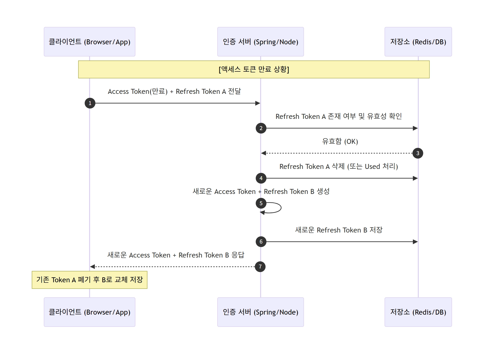
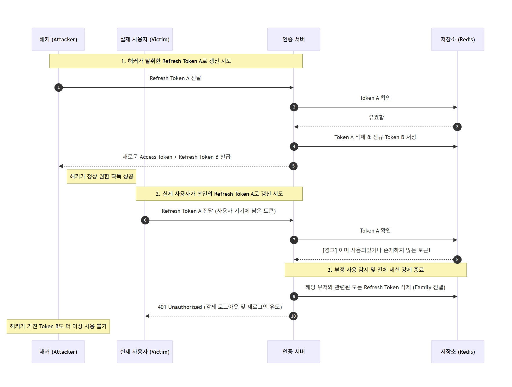

# 🚀 RTR(Refresh Token Rotation) 도입 및 운영 가이드

## 1. RTR이란?
**RTR(Refresh Token Rotation)**은 리프레시 토큰(Refresh Token)을 **일회용(One-time use)**으로 관리하는 보안 전략입니다. 액세스 토큰을 갱신할 때마다 리프레시 토큰도 함께 새로 발급하여 교체함으로써, 토큰 탈취로 인한 피해를 최소화합니다.

## 2. 도입 배경 (Problem & Solution)
* **Problem:** 리프레시 토큰은 수명이 길어(예: 2주) 한 번 탈취당하면 해커가 유효기간 내내 사용자의 권한을 도용할 수 있습니다.
* **Solution:** RTR을 도입하면 토큰이 사용되는 즉시 폐기되므로, 해커가 탈취한 토큰의 수명이 극도로 짧아지며 부정 사용을 즉각 감지할 수 있습니다.

---

## 3. 핵심 동작 프로세스

### ✅ 정상적인 토큰 갱신 (Happy Path)
1. **요청:** 클라이언트가 만료된 `Access Token`과 유효한 `Refresh Token A`를 서버에 전송합니다.
2. **검증:** 서버는 저장소(Redis 등)에 저장된 최신 토큰 정보와 `Refresh Token A`가 일치하는지 확인합니다.
3. **교체:** 확인 직후 `Refresh Token A`를 **삭제**하고, 새로운 `Refresh Token B`와 `Access Token`을 생성합니다.
4. **저장:** 서버 저장소의 유저 정보를 새 토큰인 `Refresh Token B`로 업데이트합니다.
5. **응답:** 클라이언트에 두 토큰을 전달하며, 클라이언트는 기존 토큰을 새 토큰으로 교체 저장합니다.

---

## 4. 보안의 핵심: 재사용 감지 (Reuse Detection)

RTR의 진가는 **이미 사용된 토큰이 다시 들어왔을 때** 발휘됩니다.

| 단계 | 상황 및 대응 |
| :--- | :--- |
| **Step 1** | 해커가 탈취한 `Token A`로 먼저 갱신을 시도하여 `Token B`를 획득합니다. |
| **Step 2** | 실제 사용자가 본인이 가진 `Token A`로 뒤늦게 갱신을 요청합니다. |
| **Step 3** | 서버는 **"이미 사용/폐기된 Token A"**가 들어온 것을 확인하고 침해 사고로 판단합니다. |
| **Step 4** | 서버는 해당 유저와 연결된 **모든 리프레시 토큰(Token Family)을 즉시 무효화**합니다. |
| **Step 5** | 결과적으로 해커가 들고 있던 `Token B`도 무력화되며, 해커와 사용자 모두 로그아웃됩니다. |

---

## 5. 구현 시 기술적 고려사항

### 🛠 저장소 설계 (Redis 권장)
* **데이터 구조:** `Key: user_id / Value: current_refresh_token`
* **만료 관리:** Redis의 `TTL` 기능을 활용하여 토큰 수명이 다하면 자동으로 삭제되도록 관리합니다.

### ⚠️ 주의사항 (Edge Cases)
1. **절대적 만료 시간 (Absolute Expiration):** RTR로 토큰이 계속 교체되더라도, 보안을 위해 최초 로그인 시점으로부터 일정 기간(예: 7일)이 지나면 무조건 재로그인하게 설계해야 합니다.
2. **동시성 이슈 (Concurrency):** 불안정한 네트워크 환경에서 클라이언트가 갱신 요청을 중복으로 보낼 수 있습니다. 이를 방지하기 위해 이전 토큰을 아주 짧은 시간(예: 1~2초) 동안은 유효하게 인정하는 **Grace Period** 도입을 검토하십시오.

---

## 6. 요약
* **토큰 관리는 엄격하게:** 모든 리프레시 토큰은 단 한 번만 사용됩니다.
* **검증은 확실하게:** 이미 사용된 토큰이 감지되면 즉시 모든 세션을 차단합니다.
* **보안은 선제적으로:** 탈취를 100% 막을 수 없다면, 탈취된 토큰의 가치를 0으로 만드는 것이 RTR의 목표입니다.# 🚀 RTR(Refresh Token Rotation) 도입 및 운영 가이드

## 1. RTR이란?
**RTR(Refresh Token Rotation)**은 리프레시 토큰(Refresh Token)을 **일회용(One-time use)**으로 관리하는 보안 전략입니다. 액세스 토큰을 갱신할 때마다 리프레시 토큰도 함께 새로 발급하여 교체함으로써, 토큰 탈취로 인한 피해를 최소화합니다.

## 2. 도입 배경 (Problem & Solution)
* **Problem:** 리프레시 토큰은 수명이 길어(예: 2주) 한 번 탈취당하면 해커가 유효기간 내내 사용자의 권한을 도용할 수 있습니다.
* **Solution:** RTR을 도입하면 토큰이 사용되는 즉시 폐기되므로, 해커가 탈취한 토큰의 수명이 극도로 짧아지며 부정 사용을 즉각 감지할 수 있습니다.

---

## 3. 핵심 동작 프로세스

### ✅ 정상적인 토큰 갱신 (Happy Path)
1. **요청:** 클라이언트가 만료된 `Access Token`과 유효한 `Refresh Token A`를 서버에 전송합니다.
2. **검증:** 서버는 저장소(Redis 등)에 저장된 최신 토큰 정보와 `Refresh Token A`가 일치하는지 확인합니다.
3. **교체:** 확인 직후 `Refresh Token A`를 **삭제**하고, 새로운 `Refresh Token B`와 `Access Token`을 생성합니다.
4. **저장:** 서버 저장소의 유저 정보를 새 토큰인 `Refresh Token B`로 업데이트합니다.
5. **응답:** 클라이언트에 두 토큰을 전달하며, 클라이언트는 기존 토큰을 새 토큰으로 교체 저장합니다.

---

## 4. 보안의 핵심: 재사용 감지 (Reuse Detection)

RTR의 진가는 **이미 사용된 토큰이 다시 들어왔을 때** 발휘됩니다.

| 단계 | 상황 및 대응 |
| :--- | :--- |
| **Step 1** | 해커가 탈취한 `Token A`로 먼저 갱신을 시도하여 `Token B`를 획득합니다. |
| **Step 2** | 실제 사용자가 본인이 가진 `Token A`로 뒤늦게 갱신을 요청합니다. |
| **Step 3** | 서버는 **"이미 사용/폐기된 Token A"**가 들어온 것을 확인하고 침해 사고로 판단합니다. |
| **Step 4** | 서버는 해당 유저와 연결된 **모든 리프레시 토큰(Token Family)을 즉시 무효화**합니다. |
| **Step 5** | 결과적으로 해커가 들고 있던 `Token B`도 무력화되며, 해커와 사용자 모두 로그아웃됩니다. |

---

## 5. 구현 시 기술적 고려사항

### 🛠 저장소 설계 (Redis 권장)
* **데이터 구조:** `Key: user_id / Value: current_refresh_token`
* **만료 관리:** Redis의 `TTL` 기능을 활용하여 토큰 수명이 다하면 자동으로 삭제되도록 관리합니다.

### ⚠️ 주의사항 (Edge Cases)
1. **절대적 만료 시간 (Absolute Expiration):** RTR로 토큰이 계속 교체되더라도, 보안을 위해 최초 로그인 시점으로부터 일정 기간(예: 7일)이 지나면 무조건 재로그인하게 설계해야 합니다.
2. **동시성 이슈 (Concurrency):** 불안정한 네트워크 환경에서 클라이언트가 갱신 요청을 중복으로 보낼 수 있습니다. 이를 방지하기 위해 이전 토큰을 아주 짧은 시간(예: 1~2초) 동안은 유효하게 인정하는 **Grace Period** 도입을 검토하십시오.

---

## 6. 요약
* **토큰 관리는 엄격하게:** 모든 리프레시 토큰은 단 한 번만 사용됩니다.
* **검증은 확실하게:** 이미 사용된 토큰이 감지되면 즉시 모든 세션을 차단합니다.
* **보안은 선제적으로:** 탈취를 100% 막을 수 없다면, 탈취된 토큰의 가치를 0으로 만드는 것이 RTR의 목표입니다.

## 7. 그렇다면 RTR은 완벽한가? (한계점과 보완책)

RTR은 강력하지만, 해커가 토큰을 탈취한 후 **실제 사용자가 갱신을 시도하기 전까지의 공백기**에는 여전히 위험이 존재할 수 있습니다. 이를 보완하기 위한 추가 전략이 필요합니다.

### ⚠️ 발생 가능한 시나리오
1. 해커가 토큰을 탈취하고 사용자보다 먼저 갱신을 시도하여 새로운 토큰 세트를 획득합니다.
2. 사용자가 한동안 앱을 사용하지 않아 갱신 시도를 하지 않는다면, 해커는 로테이션을 반복하며 권한을 유지할 수 있습니다.
3. 하지만 **사용자가 접속하는 순간** 중복 사용이 감지되어 해커의 권한까지 즉시 박탈됩니다.

### 🛡 추가 방어 기제 (Layered Security)
RTR과 함께 도입하면 보안성이 극대화되는 장치들입니다.

| 방어 기제 | 설명 |
| :--- | :--- |
| **IP / Device 지문 확인** | 토큰 갱신 시 IP 주소가 갑자기 바뀌거나 기기 정보(User-Agent 등)가 달라지면 즉시 차단하거나 추가 인증(2FA)을 요구합니다. |
| **짧은 만료 시간** | 액세스 토큰은 15~30분 정도로 아주 짧게 유지하여, 해커가 훔친 권한으로 활동할 수 있는 가용 시간을 최소화합니다. |
| **로그인 알림** | 새로운 환경에서 로그인이 발생하거나 토큰이 갱신되면 사용자에게 푸시 알림을 보내 이상 징후를 즉시 인지하도록 합니다. |
| **절대적 만료 시간** | 로테이션 여부와 상관없이, 최초 로그인으로부터 일정 기간(예: 7일)이 지나면 무조건 세션을 만료시키고 재로그인을 유도합니다. |

---

## 8. 최종 요약
RTR은 토큰 탈취를 100% 막는 기술이 아니라, **탈취된 토큰의 수명을 강제로 단축시키고 침해 사고를 서버가 인지할 수 있게 만드는 기술**입니다. 위에서 언급한 추가 방어 기제들과 결합할 때 비로소 완성도 높은 인증 시스템을 구축할 수 있습니다.
