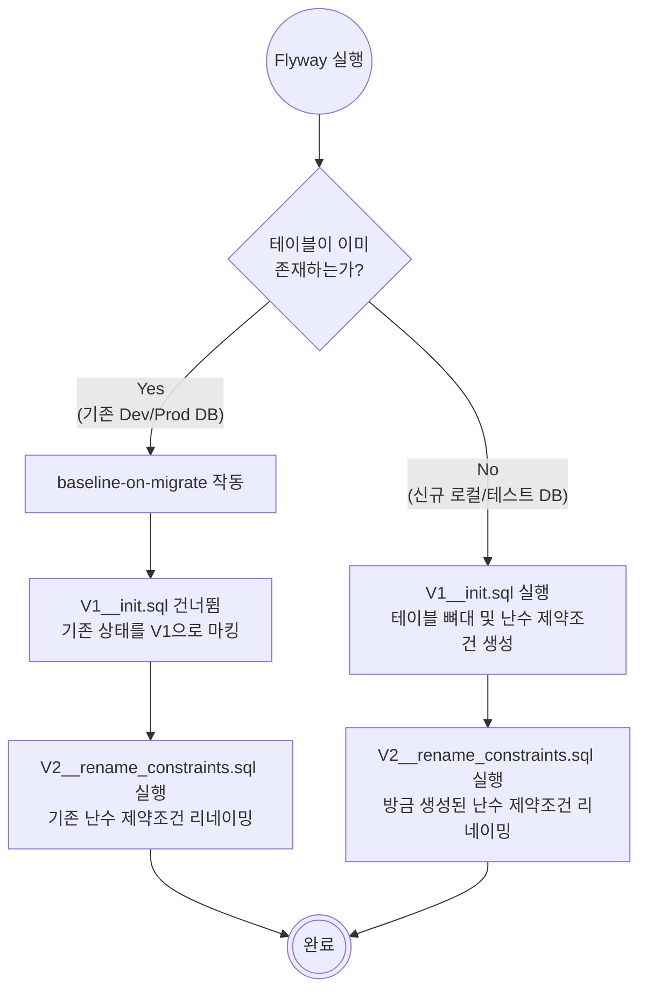

서비스가 성장하고 데이터베이스 스키마가 복잡해지면서, 엔티티 코드와 실제 DB 스키마 간의 불일치로 인한 오류가 발생했습니다.

이번 글에서는 우리 팀이 왜 Flyway를 도입하게 되었는지, 그리고 기존 운영 DB를 유지하면서 어떻게 안전하게 마이그레이션 파이프라인을 구축했는지 공유해 보려고 합니다.

## 도입 배경 및 목적

```shell
JDBC exception executing SQL ...
[ERROR: column c1_0.status does not exist
  ...]
```

### 현상: 컬럼 누락으로 인한 런타임 JDBC Exception 발생

새로운 기능을 배포한 직후, 운영 서버 로그에 무수히 많은 JDBC Exception이 찍히는 것을 발견했습니다. 

원인은 새로 추가된 기능에 필요한 테이블 컬럼이 운영 DB에 누락되어 있었기 때문입니다. 

애플리케이션 코드는 배포되었지만, DB 스키마 변경이 동기화되지 않아 발생한 전형적인 런타임 에러였습니다.

### 문제: JPA ddl-auto에 의존하던 관행의 함정과 수동 반영의 한계

그동안 저희 팀은 로컬이나 개발 환경에서 엔티티를 수정하면 테이블 구조를 알아서 바꿔주는 JPA의 `ddl-auto: update` 기능에 의존해 왔습니다. 

하지만 운영 DB에서는 데이터 유실이나 락(Lock) 등의 위험 때문에 이 기능을 꺼두어야 했습니다.

결국 로컬에서는 JPA가 다 해주지만, 운영 환경에는 개발자가 직접 변경된 DDL 스크립트를 뽑아내어 수동 실행해야만 하는 요상한 구조였습니다.

- **실수 유발 (Human Error)**: 사람이 직접 하다 보니 운영 반영을 깜빡하거나 오타를 내는 등 휴먼 에러가 발생하기 쉽습니다.

- **버전 이력 추적 불가**: **"이 컬럼이 도대체 언제, 어떤 PR과 함께, 왜 추가되었는지"** Git 히스토리처럼 명확하게 추적할 수단이 없었습니다.

### 목표: 코드 배포와 DB 스키마 변경의 동기화
위의 문제를 경험하고 애플리케이션 소스 코드와 DB 스키마 버전을 하나의 생명주기로 묶어 관리하고자 했습니다.

CI/CD 파이프라인을 통해 코드가 배포될 때 DB 스키마 변경 사항도 자동으로, 그리고 안전하게 반영되도록 만들어 서비스 안정성을 확보하는 것이 최종 목표였습니다.

이제부터 Flyway의 대해서 알아보겠습니다!

## 해결책: Flyway

Flyway는 오픈소스 데이터베이스 마이그레이션 툴입니다. 쉽게 말해 **"데이터베이스를 위한 Git"** 이라고 볼 수 있습니다.
이 문제를 해결하기 위해 도입한 것이 바로 Flyway입니다. Flyway는 쉽게 말해 **"데이터베이스를 위한 버전 관리(Git) 도구"** 입니다.

버전이 명시된 SQL 스크립트 파일(V1__init.sql, V2__add_column.sql 등)을 프로젝트 내부에 관리하면, 서버가 구동될 때 Flyway가 DB에 접속하여 현재 스키마 버전을 확인하고 누락된 스크립트들을 순차적으로 **자동 실행**해 줍니다.

## 프로젝트 적용기: 기존 운영 DB를 위한 마이그레이션 전략

Flyway를 아예 처음 시작하는 프로젝트라면 쉽겠지만, 저희는 이미 JPA로 생성되어 운영 중인 데이터베이스가 존재하는 상황이었습니다. 

따라서 기존 데이터를 보존하면서 안전하게 Flyway 통제권 안으로 가져오는 작업이 필요했습니다.

### 핵심 설정 : baseline-on-migrate: true
Spring Boot application.yml에 아래 설정을 추가했습니다. 

이 설정은 테이블이 이미 존재하는 DB 환경에서 빈 스크립트 이력(flyway_schema_history 테이블)을 생성하고, 초기 버전을 Baseline으로 마킹하여 기존 테이블들을 덮어쓰지 않게 해줍니다.

### V1과 V2 스크립트의 분리 전략
도입 과정에서 가장 신경 썼던 부분은 'JPA가 생성한 난수 형태의 제약조건 이름'을 정리하는 것이었습니다. 그래서 두 개의 파일로 전략을 나누었습니다.

- `V1__init.sql` (베이스라인): 현재 운영 DB의 스키마 상태를 그대로 추출한 초기 뼈대입니다.

- `V2__rename_constraints.sql`: V1에 존재하는 난수 제약조건들을 uk_users_email처럼 사람이 읽을 수 있는 명확한 이름으로 변경하는 스크립트입니다.

### 왜 이렇게 나눴을까?
이렇게 구성해야 운영 DB와 로컬 DB 환경 모두에서 완벽하게 동작하기 때문입니다.



## Flyway 사용 가이드
앞으로 엔티티 코드에 변경(컬럼 추가, 삭제, 타입 변경 등)이 발생하면, JPA의 ddl-auto에 의존하지 않고 반드시 Flyway 스크립트를 작성해야 합니다.

### 스크립트 작성 규칙
- **위치:** `src/main/resources/db/migration/`

- **네이밍 컨벤션:** `V{버전}__{설명}.sql`

    - 예: `V20260312.1__add_body_weight_to_users.sql`
        **(버전 뒤에 반드시 언더바 2개 사용)**

- **주의사항**
    - 한 번 원격 저장소에 머지되어 배포된 .sql 파일은 절대로 수정하면 안 됩니다.
    (체크섬 오류 발생!!)

    - 변경이 필요하다면 새로운 버전의 스크립트(V3, V4...)를 추가해야 합니다.

## 배포 파이프라인 런타임 동작

저희는 GitHub Actions를 통해 CI/CD 파이프라인이 구성되어 있습니다. 

`main` 브랜치에 코드가 머지되고 배포가 완료된 직후, Spring Boot 런타임이 구동되는 시점에 Flyway 스크립트가 자동으로 DB에 반영됩니다.
 
만약 SQL 문법 오류 등으로 마이그레이션이 실패하면 애플리케이션 구동 자체가 실패(Fail-fast)하므로 안전합니다.

---

## 👏 마무리

도입 이후, 

DB 스키마 관리가 배포 파이프라인에 자동화되어 자연스럽게 통합되면서, 스키마 동기화에 쏟던 불필요한 에너지를 줄이고 온전히 본연의 비즈니스 로직과 서비스 개발에만 집중할 수 있는 환경을 만들 수 있었습니다.

수동 관리라는 무거운 짐을 덜어내고, 개발자가 개발에만 몰입할 수 있는 더욱 탄탄하고 안정적인 인프라 구조에 한 걸음 더 가까워진 것 같습니다.

이번 경험을 바탕으로 앞으로도 더 견고한 서비스를 만들어 나가려 합니다.