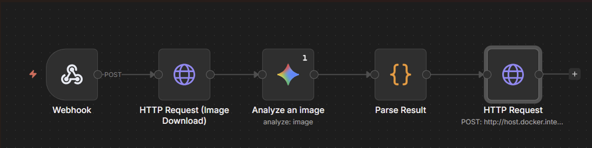
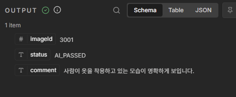
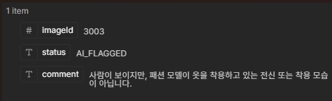

# 🤖 n8n + Claude MCP로 AI 이미지 검수 워크플로우 구축하기

## 1. n8n이란?
**n8n(노드엔)** 은 오픈소스 **워크플로우 자동화 플랫폼** 입니다. 노드(Node)라 불리는 블록들을 연결하여 데이터 흐름을 시각적으로 설계할 수 있으며, Webhook, HTTP 요청, AI 모델 호출 등 400개 이상의 노드를 제공합니다.

Zapier나 Make(구 Integromat)와 유사하지만, **셀프 호스팅이 가능** 하여 민감한 데이터를 외부 SaaS에 노출하지 않고 자체 서버에서 운영할 수 있다는 것이 가장 큰 차별점입니다.

### n8n vs 다른 자동화 도구

| 항목 | n8n | Zapier | Make |
| :--- | :--- | :--- | :--- |
| **호스팅** | 셀프 호스팅 (Docker) | SaaS only | SaaS only |
| **비용** | 무료 (Community Edition) | 유료 (실행 건수 과금) | 유료 (실행 건수 과금) |
| **코드 노드** | JavaScript/Python 코드 실행 가능 | 제한적 | 제한적 |
| **AI 연동** | Gemini, OpenAI, Claude 등 네이티브 지원 | 제한적 | 제한적 |
| **데이터 통제** | 자체 서버에서 데이터 처리 | 외부 서버 경유 | 외부 서버 경유 |

---

## 2. 왜 n8n을 선택했는가?

### Problem
패션 코디 이미지를 크롤링하면 사람이 착용한 전신 코디샷뿐 아니라 **바닥컷, 제품 단독샷, 사람 없는 이미지** 등이 섞여 들어옵니다. 이를 수작업으로 하나하나 분류하는 것은 비효율적이며, AI로 자동 분류하되 **WAS 서버에 영향을 주지 않는 구조**가 필요했습니다.

### Solution 비교: LangChain vs n8n

| 관점 | LangChain | n8n |
| :--- | :--- | :--- |
| **언어** | Python 기반 | 언어 무관 (HTTP 통신) |
| **Java 프로젝트 연동** | Python 서비스 별도 구축 필요 | Webhook 한 줄로 연동 |
| **장애 격리** | 앱 내부 실행, 장애 전파 위험 | 별도 서버, 완전 분리 |
| **AI 로직 변경** | 코드 수정 → 빌드 → 재배포 | n8n UI에서 즉시 반영 |
| **모니터링** | 별도 구축 필요 | 실행 이력/에러 로그 UI 기본 제공 |
| **적합한 유스케이스** | 복잡한 LLM 체이닝, RAG, Agent | 단순 파이프라인, 외부 시스템 연동 |

우리의 요구사항은 **이미지 다운로드 → AI 분석 → 결과 콜백**이라는 단순한 파이프라인이었기 때문에, LangChain은 오버엔지니어링이었고 n8n이 최적의 선택이었습니다.

---

## 3. 워크플로우 설계

### 전체 아키텍처
```
[Spring Boot WAS]                          [n8n 서버 (별도 EC2)]
      |                                          |
      |  1. POST /webhook/outfit-filter          |
      |  (cardImageId, imageUrl)                 |
      |----------------------------------------->|
      |                                          |
      |  2. 즉시 200 OK 응답                      |
      |<-----------------------------------------|
      |                                          |  3. 이미지 다운로드
      |                                          |  4. Gemini AI 분석
      |                                          |  5. 결과 파싱
      |  6. POST /i/v1/inspections/callback      |
      |  (imageId, status, comment)              |
      |<-----------------------------------------|
      |                                          |
      |  7. DB 상태 업데이트                       |
      |  (PENDING → AI_PASSED / AI_FLAGGED)      |
```

### n8n 워크플로우 노드 구성

```
[Webhook] → [Image Download] → [Gemini AI] → [Parse Result] → [HTTP Callback]
```

| 노드 | 타입 | 역할 |
| :--- | :--- | :--- |
| **Webhook** | Trigger | `POST /webhook/outfit-filter` 수신, 즉시 응답 (responseMode: onReceived) |
| **Image Download** | HTTP Request | imageUrl에서 이미지 바이너리 다운로드 |
| **Gemini AI** | Google Gemini | 이미지를 Gemini 2.5 Flash에 전송하여 분석 |
| **Parse Result** | Code (JS) | Gemini 응답에서 status, aiComment 추출 |
| **HTTP Callback** | HTTP Request | Spring Boot 콜백 엔드포인트로 결과 전송 |

---

## 4. Gemini AI 프롬프트 설계

AI 판정의 정확도는 **프롬프트의 구체성**에 달려 있습니다. 단순히 "이미지를 분석해줘"가 아니라, **역할 부여 + 구체적 판정 기준 + 출력 포맷 고정**으로 설계했습니다.
프롬프트를 구성하면서 프롬프트에 따라 결과값이 달라지는 걸 깨닫고, 프롬프트의 중요성을 다시 한번 깨닫게 되었습니다.
```
너는 패션 매거진의 매우 엄격한 이미지 검수자야.
1. 사진에 실제 '사람(모델)'이 보이지 않으면 무조건 'AI_FLAGGED'야.
2. 신발, 가방, 옷만 덩그러니 놓여 있는 '바닥 컷'이나 '제품 단독 샷'은
   절대로 통과시키지 마.
3. 오직 사람이 직접 옷을 입고 있는 '전신' 또는 '착용 모습'이 보일 때만
   'AI_PASSED'로 설정해.
결과를 아래 JSON 형식으로만 답해:
{"status": "AI_PASSED" 또는 "AI_FLAGGED", "aiComment": "이유(50자 이내)"}
```

### 프롬프트 설계 포인트

| 기법 | 적용 내용 | 이유 |
| :--- | :--- | :--- |
| **역할 부여** | "패션 매거진의 매우 엄격한 이미지 검수자" | 엄격한 기준을 유도하여 false positive 최소화 |
| **부정 조건 명시** | "바닥 컷이나 제품 단독 샷은 절대로 통과시키지 마" | 모호한 경계 케이스에서 FLAGGED 쪽으로 유도 |
| **긍정 조건 한정** | "오직 사람이 직접 옷을 입고 있는 경우만" | 통과 조건을 최소한으로 제한 |
| **출력 포맷 고정** | JSON 형식 지정 | 파싱 실패 방지, 후속 노드에서 안정적 처리 |

### 판정 결과 예시

| 이미지 유형 | 판정 | aiComment |
| :--- | :--- | :--- |
| 모델이 코디를 착용한 전신샷 | `AI_PASSED` | "사람이 직접 옷을 착용하고 있어 통과합니다." |
| 옷만 놓여있는 바닥컷 | `AI_FLAGGED` | "제품만 단독으로 놓여 있어 통과 불가합니다." |
| 신발/가방 클로즈업 | `AI_FLAGGED` | "사람(모델)이 보이지 않습니다." |
| 사람은 있지만 상반신만 | `AI_FLAGGED` | "전신 착용 모습이 아닙니다." |

|                       사용된 이미지                       |                   Gemini AI 노드 분석                   |
|:---------------------------------------------------:|:---------------------------------------------------:|
|  |  |
|                     **사용된 이미지**                     |                 **Gemini AI 노드 분석**                 |
|  |  |
---

## 5. Claude MCP로 n8n 워크플로우 관리하기

### MCP(Model Context Protocol)란?
**MCP**는 AI 모델이 외부 도구와 직접 상호작용할 수 있게 해주는 프로토콜입니다. Claude Code에서 MCP 서버를 연결하면, **터미널에서 대화하듯이 n8n 워크플로우를 생성, 수정, 디버깅**할 수 있습니다.

### n8n MCP 서버 연동

```json
// .mcp.json
{
  "mcpServers": {
    "n8n-mcp": {
      "type": "npx",
      "args": ["@anthropic/n8n-mcp-server"],
      "env": {
        "N8N_BASE_URL": "http://localhost:5678",
        "N8N_API_KEY": "<API_KEY>"
      }
    }
  }
}
```

이 설정만으로 Claude가 n8n API에 직접 접근하여 워크플로우를 조회, 생성, 수정할 수 있게 됩니다.

### MCP로 수행한 작업들

**1. 워크플로우 실시간 조회**
```
나: "현재 n8n 워크플로우 상태 확인해줘"
Claude: n8n_get_workflow 호출 → 5개 노드, active 상태, 버전 220 확인
```
로컬에 저장된 JSON이 아닌 **n8n 서버의 실제 최신 상태**를 직접 확인할 수 있었습니다.

**2. 워크플로우 노드 수정**
```
나: "Webhook이 즉시 응답하도록 바꿔줘"
Claude: n8n_update_partial_workflow 호출
        → responseMode: "lastNode" → "onReceived" 변경
```
n8n UI에 접속하지 않고도 **터미널에서 바로 노드 설정을 변경**하고, 변경 사항이 즉시 반영되었습니다.

**3. 실행 로그 디버깅**
```
나: "왜 워크플로우가 실패했지?"
Claude: n8n_executions(action=get, mode=error) 호출
        → "NoSuchKey: 이미지 URL이 S3에서 삭제된 상태"
        → 에러 원인 + 실행 경로 + 입력 데이터까지 한 번에 확인
```
n8n UI의 실행 로그를 열어보지 않고도, **에러 원인과 각 노드의 입출력 데이터**를 터미널에서 바로 분석할 수 있었습니다.

### MCP 활용의 장점

| 기존 방식 | MCP 활용 |
| :--- | :--- |
| n8n UI 접속 → 노드 클릭 → 설정 변경 → 저장 | 터미널에서 한 줄 명령으로 즉시 변경 |
| 실행 실패 → UI에서 로그 찾기 → 노드별 확인 | 에러 모드 조회로 원인 + 경로 + 데이터 한 번에 확인 |
| 워크플로우 export → 파일 저장 → 수동 관리 | MCP로 최신 상태 조회 후 자동 export |
| 코드 작성 ↔ n8n 설정 컨텍스트 스위칭 | 하나의 터미널에서 코드 + 워크플로우 동시 작업 |

---

## 6. SOP(표준 작업 절차서)의 필요성

### 왜 SOP가 필요한가?
Claude MCP에게 "n8n 워크플로우 만들어줘"라고 하면 **제대로 된 결과가 나오지 않습니다.** AI는 우리 프로젝트의 백엔드 구조, 페이로드 형식, 에러 처리 정책을 알 수 없기 때문입니다.

SOP는 AI에게 **"이 규칙대로 만들어"** 라고 전달하는 명세서 역할을 합니다. SOP를 작성한 후 MCP에게 함께 전달하면, 프로젝트 컨벤션에 맞는 워크플로우를 정확하게 생성할 수 있었습니다.

### SOP에 포함한 내용

**1. 트리거 (Webhook Node) 명세**

수신할 페이로드 구조를 명확히 정의합니다. 이것이 없으면 AI가 필드명을 임의로 생성합니다.
```json
{
  "cardImageId": "고유 식별자 (String/Number)",
  "imageUrl": "검수할 상품 이미지의 URL 주소",
  "productTitle": "해당 상품의 이름/타이틀 (판별 참고용)"
}
```

**2. AI 처리 (Gemini Node) 명세**

사용할 모델, 입력 방식, 프롬프트를 구체적으로 기술합니다.
- Model: Gemini 2.0 Flash (비전 및 텍스트 처리에 최적화)
- Operation: Analyze an image
- Input: HTTP Request 노드에서 다운로드한 바이너리 파일

**3. 결과 반환 명세**

콜백으로 보낼 데이터 구조를 명시합니다.
```json
{
  "cardImageId": "Webhook에서 받은 원본 cardImageId",
  "status": "AI_PASSED 또는 AI_FLAGGED",
  "aiComment": "Gemini가 작성한 판별 사유"
}
```

**4. 예외 처리 및 로깅 정책**

| 항목 | 설정 |
| :--- | :--- |
| Retry 대상 | Google Gemini Node |
| Retry 조건 | 5xx 에러 또는 Rate Limit(429) |
| 최대 재시도 | 5회 (간격: 5000ms) |
| URL 전처리 | `.trim()` 적용 (공백/마침표 에러 방지) |

### SOP 유무에 따른 결과 차이

| 구분 | SOP 없이 요청 | SOP와 함께 요청 |
| :--- | :--- | :--- |
| **페이로드** | 필드명이 임의로 생성됨 | 백엔드 API 스펙과 정확히 일치 |
| **AI 노드** | 모델/프롬프트가 부정확 | 지정한 모델 + 검증된 프롬프트 적용 |
| **콜백 구조** | 누락되거나 형식 불일치 | Spring Boot 콜백 API에 맞는 형식 |
| **에러 처리** | 미설정 | Retry + URL 전처리 적용 |
| **수정 횟수** | 여러 차례 수정 필요 | 1~2회 내 완성 |

> **핵심: SOP는 AI를 위한 프롬프트이자, 팀을 위한 문서입니다.** AI에게 정확한 결과물을 얻기 위해 작성한 SOP가 곧 팀원들이 워크플로우를 이해하는 기술 문서가 됩니다.

---

## 7. 장애 격리 설계

n8n은 별도 서버에서 실행되기 때문에, **WAS와 완전히 분리된 장애 도메인**을 가집니다.

### 방어 레이어

| 레이어 | 구현 | 효과 |
| :--- | :--- | :--- |
| **비동기 요청** | `@Async` 전용 스레드풀 | n8n 호출이 메인 스레드를 블로킹하지 않음 |
| **HTTP 타임아웃** | Connect 3초 / Read 5초 | n8n 무응답 시 빠른 실패 처리 |
| **Fallback** | 통신 실패 → `WORKER_ERROR` 마킹 | 예외가 상위로 전파되지 않음 |
| **즉시 응답** | Webhook `responseMode: onReceived` | AI 분석 완료를 기다리지 않음 |
| **콜백 패턴** | n8n이 완료 후 Spring Boot로 POST | WAS가 n8n에 폴링하지 않음 |

### 장애 시나리오별 동작

```
1. n8n 서버 다운
   → 3초 내 Connection Refused
   → InspectionFallbackHandler → WORKER_ERROR 마킹
   → 크롤링/카드 저장은 정상 완료 (이미 커밋됨)
   → n8n 복구 후 WORKER_ERROR 건 재처리 가능

2. Gemini API 응답 지연
   → 영향 없음. onReceived로 즉시 200 반환
   → 콜백이 늦더라도 Spring Boot는 대기하지 않음

3. 콜백 실패 (Spring Boot 일시 장애)
   → ImageInspection이 PENDING 상태로 유지
   → 관리자가 수동 확인 가능
```

---

## 7. 요약

* **n8n은** 셀프 호스팅 가능한 워크플로우 자동화 도구로, 코드 없이 AI 파이프라인을 구축할 수 있습니다.
* **WAS와 AI 서비스를 완전히 분리**하여, AI 서버 장애가 핵심 비즈니스 로직에 영향을 주지 않도록 설계했습니다.
* **Claude MCP**를 활용하면 n8n 워크플로우를 터미널에서 직접 조회, 수정, 디버깅할 수 있어 개발 생산성이 크게 향상됩니다.
* **프롬프트 엔지니어링**을 통해 AI 판정 정확도를 높이고, 출력 포맷을 고정하여 후속 처리의 안정성을 확보했습니다.
